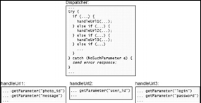

# Chapter 10

## Define Errors Out Of Existence
 - Exception handling is one of the worst sources of complexity in software systems. **Code that deals with special conditions is inherently harder to write than code that deals with normal cases** and developers often define exceptions without considering how they will be handled.
  
  ## 10.1 Why exceptions add complexity
   > It uses term *exception* to refer to any uncommon condition that alters the normal flow of control in a program. Many programming languages include a formal exception mechanism that allows exceptions to be thrown by lower-level code and caught by enclosing code.
   - A particular piece of code may encounter exceptions in several different ways:
     - A caller may provide bad arguments or configuration information
     - An invoked method may not be able to complete a requested operation. For example, an I/O operation may fail, or required resource may not be available
     - In a distributed system, network packets may be lost or delayed, servers may not respond in a timely fashion, or peers any communicate in unexpected ways.
     - The code may detect bugs, internal inconsistencies, or situations it is not prepared to handle
  - Large systems have to deal with many exceptional conditions, particularly if they are distributed or need to be fault-tolerant. Exceptions handling can account for a significant fraction of all the code in a system.

 > Exceptions handling code is in inherently more difficult to write than normal-case code. An exception disrupts the normal flow of the code; it usually means that something didn't work as expected/
 - When exception occurs, it can be dealt in two ways
   - The first approach is to move forward and complete the work in progress in spite of the exception.
   - The second approach is to abort the operation in progress and report the exception upwards.
     - However, aborting can be complicated because the exception may have occurred at a point where system state is inconsistent
  - ***The exceptions handling code must restore consistency, such as by unwinding any changes made before the exception occurred***

 > Furthermore, exception handling code creates opportunities for the exceptions. Consider the case of resending a lost network packet. Perhaps the packet wan't actually lost, but was simply delayed. In this case, resending the packet will result in duplicate packets arriving at the peer; this introduces a new exceptional condition that the peer must handle. Or, consider the case of recovering lost data from a redundant copy.
  - To prevent an unending cascade of exceptions, The developer must eventually find a way to handle exceptions without introducing more exceptions.

 > It's difficult to ensure that exception handling code really works. Some exceptions, such I/O errors, can't easily be generated in a test environment. so it's hard to test the code that handles them.
  - Bugs can go undetected for a long time, and when the exception handling code is finally needed, there's a good chance that it worn't work.
    - ***Code that hasn't been executed doesn't work***
  - A recent study found that more than 90% of catastrophic failures in distributed data-intensive systems were caused by incorrect error handling.
  - When exceptions handling code fails, it's difficult to debug the problem, since it occurs so infrequently.

## 10.2 Too many exceptions
 > Programmers exacerbate the problems related to exception handling by defining unnecessary exceptions. Mos programmers are thought that it's important to detect and report errors; they often interpret this to mean "the more errors detected, the better"
  - This leads to an over-defensive style where anything that looks even a bit suspicious is rejected with an exception, which results in a proliferation of unnecessary exceptions that increase the complexity of the system.

 > It's tempting to use exceptions to avoid dealing with difficult situations: rather than figuring out a clean way to handle it, just throw an exceptions and punt the problem to the caller. 
 - If BE is having trouble figuring out what to do for the particular situation, there's a good chance that the caller won't know what to do either.
 - **Generating an exception in a situation like this just passes the problem to someone else and adds to the system's complexity.**

 > The exceptions thrown by a class are part of its interface; ***classes with logs of exceptions have complex interfaces, and they are shallower than classes with fewer exceptions***
 - An exception is a particularly complex element of an interface. It can propagate up through several stack levels before being caught, so it affects not just the method's caller, but potentially also higher-level callers(and their interfaces)
 - Throwing exceptions is easy; handling them is hard. Thus, the complexity of exceptions comes from the exceptions handing code.
 - The best way to reduce the complexity damage caused by exception handling is to **reduce the number of places where exceptions have to be handled**

## 10.3 Define errors out of existence
 > The best way to eliminate exceptions handling complexity to define your APIs so that there are no exceptions to handle: **define errors out of existence**
 - This may seem sacrilegious, but it's very effective in practice.
 - If the method tries to do some error like behavior(like to *unset()* at the beginning of the text), just returning rather then throw an exception is better since you wouldn't need to add any complexity to handle the error anywhere.
 - The error-ful approach may catch some bugs, but it also increases complexity, which results in other bugs.
   - In the error-ful approach, developers must write additional code to avoid or ignore the errors, and this increases the likelihood of bugs.
   - ***Overall, the best way to reduce bugs is to make software simpler.***

## 10.6 Mask exceptions
 > The second technique for reducing the number of places where exceptions must be handled is *exception masking*. 
 - With this approach, an exceptional condition is detected and handled at a low level in the system, so that higher levels of software need not be aware of the condition.

## 10.7 Exception aggregation
 > The third technique for reducing complexity related to exceptions is *exceptions aggregation.* The idea behind exception aggregation is to handle many exceptions with a single piece of code; rather than writing distinct handlers for many individual exceptions, handle them all in once place with a single handler.
 - Instead of catching the exceptions in the individual service methods, let them propagate up to the top-level dispatch method for the WEB server as in **Figure 10.2**

## **Figure 10.2**

 > The aggregation described in the preceding paragraph has good properties from the standpoint of encapsulation and information hiding.
  - The top-level exception handler encapsulates knowledge about how to generate error responses, but it knows nothing about specific errors; it just uses the error message provided in the exception.
  - Exception aggregation works best if an exception propagates several levels up the stack before it is handled; this allows more exceptions from more methods to be handled in the same place.
    - This is the opposite of exceptions masking: masking usually works best if an exceptions is handled in a low-level method.
    - For masking, the low-level method is typically a library method used by many other methods, so allowing the exception to propagate would increase the number of places where it's handled.
    - Masking and aggregation are similar in that both approaches position an exception exception handler where it can catch the most exceptions, eliminating many handlers that would otherwise need to be created.

 > One way of thinking about exception aggregation is that it replaces several special-purpose mechanisms, each tailored for a particular situation, with a single general-purpose mechanism that can handle multiple situations.
  - This provides another illustration of the benefits of general-purpose mechanisms.

## 10.8 Just crash?
 > The fourth technique for reducing complexity related to exception handling is to crash the application. In most applications there will be certain errors that it's not worth trying to handle. Typically, these errors are difficult or impossible to handle and don't occur very often.
  - The simplest thing to do in response to these errors is to print diagnostic information and then abort the application.
  - In newer languages such a Java and C++, the *new* operator throws an exception is memory is exhausted.
    - Dynamically allocated memory is such a fundamental element of any modern application that it doesn't make sense for the application to continue if memory is exhausted; it's better to crash as soon as the error is detected.
  - Aborting with an error message is also appropriate if an application encounters an internal error such as an inconsistent data structure. Conditions like this probably indicate bugs in the program.

## 10.9 Design special cases out of existence
  > For the same reason that it makes sense to define error out of existence, it also makes sense to define other special cases out of existence.
  - Special cases can result in code that is riddled with *if* statements, which make the code hard to understand and lead to bugs.
    - Thus, special cases should be eliminated wherever possible. The best way to do this is by designing the normal case in a way that automatically handles the special cases without any extra code.
  - It's good to have *Empty/Exit* state to handle case you'd like to avoid more than just throw an error and let otherwhere handle it

 ## 10.10 Taking it too far
 > Defining away exceptions, or masking them inside a module, only makes sense if the exception information isn't needed outside the module.
 - In the rare situations where cases detected by the exceptions, there are other ways for it to get this information.
   - However, it's possible to take this idea too far. e.g. if all network error are masked, when a network error occurred, the module caught it, discarded it, and continued as if there were no problem.
   - This mean that applications using the module had no way to find out if messages were lost or a peer server failed;
   - without this information, it was impossible to build robust applications.
     - That indicates that the information is essential for the module to expose the exceptions even though they add complexity to the module's interface.

 > With exception, as with many other areas in software design, you must determine what is important and what is not. 
 - Things that are not important should be hidden, and the more of them the better. But when something is important, it MUST be exposed.

## 10.11 Conclusion
 > Special cases of any form make code harder to understand and increase the likelihood of bugs. This chapter focused on exceptions, which are one of the most significant sources of special-case code, and discussed how to reduce the number of places where exceptions must be handled.
  - The best way to do this is by redefining semantics to eliminate error conditions.
  - For exceptions that can't be defined away, you should look for opportunities to mask them at a low level(even in BE - FE relationship), so their impact is limited, or aggregate several special-case handlers into a single more generic handler.
  - Together, these techniques can have a significant impact of overall system complexity
