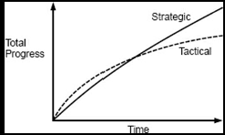

# Chapter 3

## Working Code Isn't Enough(Strategic vs Tactical Programming)
> One of the most important elements of good software design is the mindset you adopt when you approach a programming task\
> Many organizations encourage a tactical mindset, focused on getting features working as quickly as possible.

## 3.1 Tactical programing
 > Most programmers approach software development with a mindset I call ***tactical programming***\
 - In the tactical approach, your main focus is to get something working.
   - such as a new feature or a bug fix.
 - As a result, it makes it nearly impossible to produce a good system design

 > The problem with tactical programming is that it's short-sighted. If you're programming tactically, you're trying to finish a task as quickly as possible.
  - This is how systems become complicated. Complexity is incremental. Thus, the longer the team continues this, the more it is the complexity of the project
 - The complexities accumulate rapidly, especially if everyone is programming tactically.

> Almost every software development organization has at least one developer who takes tactical programming to extreme: a ***tactical tornado***.
  - Tactical tornado is a developer who often finishes its job way faster but in a tactic manner.
    - So other developers left behind needs to clean up its mess.
 - Don't be this kind of developer

## 3.2 Strategic programming
 > The first step towards becoming a good software designer is to realize that **Working code is not enough**\
  > It's not acceptable to introduce unnecessary complexities in order to finish your current task faster.
 - Most of the code in any system is written by extending the existing code base, so your most important job as a developer is to facilitate those future extensions.
 - Your primary goal must be to produce a great design, which also happens to work.
   - This is ***strategic programming***

> Strategic programming requires an investment mindset. Rather than taking the fastest path to finish your current project, you must invest time to improve the design of the system.
 - This investment will slows you down in a short term, but it will speed up in long term as a team.

> It's worth taking a little extra time to find a simple design for each new class; rather than implementing the first idea that comes to mind, try a couple of alternative designs./
> Writing good documentation is another example of proactive investment(type, wiki, comment, etc.)
 - No one is perfect. Thus, you will find some problem in your design decisions.
   - You should fix then rather than ignore or patch around it.
   - It will continually make small improvements to the system design. This is opposite of **Tactical Programming**

## 3.3 How much to invest?
 > So, what is the right amount of investment? The best approach is to make lots of small investments on a continual basis.
  - The arthur suggests spending about 10-20% of the total development on *investments*

## Strategic vs Tactical in image

 > Conversely, if you program tactically, you will finish your first projects 10–20% faster, but over time your development speed will slow as complexity accumulates. It won’t be long before you’re programming at least 10–20% slower.
 - You'll quickly give back all of the time you saved at the beginning if you do to tactic programming.

## 3.4. Startups and investment
 > Typically in startups, feel tremendous pressure to get their early releases out quickly. In these companies, it might seem that even a 10–20% investment isn’t affordable.\
 > As a result, They rationalize this with the thought that, if they are successful, they’ll have enough money to hire extra engineers to clean things up.
 - Once a code base turns to spaghetti, it's nearly impossible to fix.
   - The company will pay high development costs for the life of the product.

 > The best way to lower development costs is to hire great engineers: they don’t cost much more than mediocre engineers but have tremendously higher productivity.

 ## 3.5 Conclusion
  > Good design doesn’t come for free. It has to be something you invest in continually, so that small problems don’t accumulate into big ones.
 - Good design eventually pays fo itself, and sooner than you might think.
 - The longer you wait to address design problems, the bigger they become; the solutions become more intimidating.