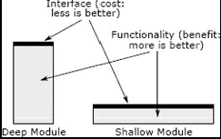

# Chapter 4

## Modules Should Be Deep
> One of the most important techniques for managing software complexity is to design systems so that developers only need to face a small fraction of the overall complexity at any given time.
 - This approach is called **Modular Design**

## 4.1 Modular design
 > In modular design, a software system is decomposed into a collection of *modules* that are relatively independent.\
 > Modules can take many forms, such as classes, subsystems, or services.
  - In an ideal world, each module would be completely independent of the others.

> Unfortunately, this ideal is not achievable. Modules must work together by calling each others’s functions or methods.
 - Eventually changing one place affects other modules too, of course it's one of the down sides of complexity.

> In order to manage dependencies, we think of each module in two parts: an ***interface*** and an ***implementation***.
 - The **interface** describes *what* the module does but not *how* it does it.
 - The **implementation** consists of the code that carries out the promises made by the interface.

 > For the purposes of this book, a module is any unit of code that has an interface and an implementation.
 - Whatever the shape of codes, as long as it has interface and implementation, it's module.

 > For the purposes of this book, a module is any unit of code that has an interface and an implementation.\
  > Such modules have two advantages.
  - First, a simple interface minimizes the complexity that a module imposes on the rest of the system.
  - Second, if a module is modified in a way that doesn't change its interface, then no other module will be affected by the modification.
  - If a module's interface is much simpler than its implementation, there will be many aspects of the module that can be changed without affecting other modules.
    - In a super simplified way, changing a function's inside without changing its argument and name.

## 4.2 What's in an interface?
 >The interface to a module contains two kinds of information: formal and informal.

### formal parts(type, name, etc)
 - The formal parts of an interface are specified explicitly in the code.
 - that includes the names and types of its parameters, and type of its return value, and information about exceptions thrown by method.
    - In class's case, it consists of the signatures for all of its public methods, plus the names and types of any public variables.

### informal parts(comment, docs, etc)
 > Each interface also includes informal elements. These are not specified in a way that can be understood or enforced by the programming language.
 - The informal parts of an interface includes its high-level behavior, such as the fact that a function deletes the file named by one of its arguments.
 - if a developer needs to know a particular piece of information in order to user a module, then that information is part of the modules's interface.
    - an informal aspects of an interface can only described using comments, and the programming language cannot ensure that the description is complete or accurate.
 - The biggest benefits of informal parts is that it indicates exactly what developers need to know in order to use the associated module.
   - That eliminate "unknown unknowns" problem.

## 4.3 Abstractions
 > The term abstraction is closely related to the idea of modular design. **An abstraction is a simplified view of an entity, which omits unimportant details.**
 - Abstractions are useful because they make it easier for us to think about and manipulate complex things.

> In modular programming, each module provides an abstraction in form of its interface. The interface presents a simplified view of the module’s functionality
 - The details of the implementation are unimportant form the standpoint of the modules's abstraction, so they are omitted from the interface.

 > In the definition of abstraction, the word “unimportant” is crucial. The more unimportant details that are omitted from an abstraction, the better.\
 > However, a detail can only be omitted from an abstraction if it is unimportant. An abstraction can go wrong in two ways.

### First
 - it can include details that are not really important
   - when this happens, it makes the abstractions more complicated than necessary, which increases the cognitive load on developers using the abstraction.

### Second
 - When an abstraction omits details that really are important
   - This results in obscurity: developers looking only at the abstraction will not have all the information they need to use the abstraction correctly.
 - The abstraction that omits important details is a *false abstraction*
   - It might appear simple, but in reality it isn't. The key to designing abstractions is to understand what is important, and to look for designed that minimize the amount of information that is important

 > As an example, consider a file system. The abstraction provided by a file system omits many details, such as the mechanism for choosing which blocks on a storage device to use for the data in a given file. These details are unimportant to users of the file system.

 > We depend on abstractions to manage complexity not just in programming, but pervasively in our everyday lives.\
  > A microwave oven contains complex electronics to convert alternating current into microwave radiation and distribute that radiation throughout the cooking cavity
   - But in reality, users only see few buttons to control the timing and intensity of the microwaves.
   - Cars are good example too. You know what I mean.

## 4.4 Deep modules
 > The best modules are those that provide powerful functionality yet have simple interfaces. The arthur describes such modules as ***deep modules***
 - The deep modules are the ideal ones

### Deep module and shallow module

 > The area of each rectangle is proportional to the functionality implemented by the module. The top edge of a rectangle represents the module’s interface; the length of that edge indicates the complexity of the interface. The best modules are deep: they have a lot of functionality hidden behind a simple interface.
 - The reason deep modules are better is that they have a log of functionality hidden behind a simple interface(Somewhere callable from other modules).
   - A deep module is a good abstractions because only a small fraction of its internal complexity is visible to others.

 > Module depth is a way of thinking about cost versus benefit. The benefit provided by a module is its functionality. The cost of a module (in terms of system complexity) is its interface.
 - A modules's interface represents the complexity that the module imposes on the rest of the system.
  - The smaller and simpler the interface, the less complexity that it introduces.
  - **Smaller interface = smaller cost**

 ## RED FLAG: Shallow Module
  > A shallow module is one whose interface is complicated relative to the functionality it provides.
 - Shallow modules don't help much in the battle against complexity, because the benet they provide(not having to learn about how they work internally) is negated by the cost of learning and using their interfaces.
   - Small modules tend to be shallow

## 4.6 Classitis
 > Unfortunately, the value of deep classes is not widely appreciated today. The conventional wisdom in programming is that classes should be small, not deep.
 - Dividing a large class/module into smaller pieces isn't always the best. It results in large numbers of shallow classes and methods, which add to overall system complexity.

 > The extreme of the “classes should be small” approach is a syndrome I call classitis, which stems from the mistaken view that *“classes are good, so more classes are better.”*
 - These small modules' interfaces accumulate to create tremendous complexity at the system level.
   - Small classes also result in a verbose programming style, due to the boilerplate required for each class.

 ## Conclusion
  > By separating the interface of a module from its implementation, we can hide the complexity of the implementation from the rest of the system.\
  > Users of a module need only understand the abstraction provided by its interface.
 - The MOST important issue in designing classes and other modules is to make them deep, so that they have simple interfaces for the common use case, yet still provide significant functionality. This maximizes the amount of complexity that is concealed.

