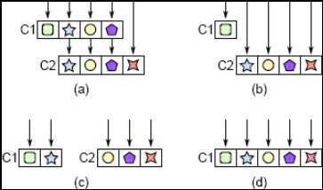
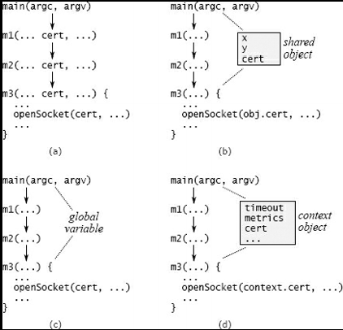

# Chapter 7

## Different Layer, Different Abstraction
 > Software systems are composed in layers, where higher layers use the facilities provided by lower layers.\
 > In a well-designed system, each layer provides a different abstraction from the layers above and below it\
- It was repeatedly mentioned in Uncle Bob's book
 - if you follow a single operation as it moves up and down through layers by invoking methods, the abstractions change with each method call. For example:
   - In a file system, the uppermost layer implements a file abstraction. A file consists of a variable-length array of bytes, which can be updated by reading and writing variable-length byte ranges.
   - The next lower layer in the file system implements a cache in memory of fixed-size disk blocks; callers can assume that frequently used blocks will stay in memory where they can be accessed quickly. The lowest layer consists of device drivers, which move blocks between secondary storage devices and memory.

 > If a system contains adjacent layers with similar abstractions, this is a red flag that suggests a problem with the class decomposition.
 - This chapter discusses situations where this happens, the problems that result, and how to refactor to eliminate the problems.

## 7.1 Pass-through methods
 > When adjacent layers have similar abstractions, the problem often manifests itself in the form of *pass-through* methods.
 - A pass-through method is one that does little except invoke another method, whose signature is similar or identical to that of the calling method. 

 ## RED FLAG: Shallow Module
  - A pass-through method is one that does nothing except pass its arguments to another method, usually with the same API as the pass-through method. This typically indicates that there is not a clean division of responsibility between the classes.

 > Pass-through methods make classes shallower: they increase the interface complexity of the class, which adds complexity, but they don’t increase the total functionality of the system.
 - Pass-through methods also create dependencies between classes

 > Pass-through methods indicate that there is confusion over the division of responsibility between classes.
 - ***The interface to a piece of functionality should be in the same class that implements the functionality.***
 - When you see pass-through methods from one class to another, consider the two classes and ask yourself “*Exactly which features and abstractions is each of these classes responsible for?*”
   - You will probably notice that there is an overlap in responsibility between the classes.
 
 > The solution is to refactor the classes so that each class has a distinct and coherent set of responsibilities.
  - **Figure 7.1** illustrates several ways to do this. One approach, shown in **Figure 7.1(b)**, is to expose the lower level class directly to the callers of the higher level class, removing all responsibility for the feature from the higher level class.
 - Another approach is to redistribute the functionality between the classes, as in **Figure 7.1(c).** Finally, if the classes can’t be disentangled, the best solution may be to merge them as in **Figure 7.1(d)**.

## Figure7.1

## When is interface duplication OK?
 > Having methods with the same signature is not always bad. The important thing is that each new method should contribute significant functionality.
 - Pass-through methods are bad because they contribute no new functionality.

 > One example where it’s useful for a method to call another method with the same signature is a ***dispatcher***.
 - A dispatcher is a method that uses its arguments to select one of several other methods to invoke; then it passes most or all of its arguments to the chosen method.
 - The signature for the dispatcher is often the same as the signature for the methods that it calls.
 - Even so, the dispatcher provides useful functionality: it chooses which of several other methods should carry out each task.
   - ***Like if it's A, call A' function and if it's B, call B' function like method.***

 > It is fine for several methods to have the same signature as long as each of them provides useful and distinct functionality.
 - The methods invoked by a dispatcher have this property.

## 7.3 Decorators
 > The decorator design pattern (also known as a “wrapper”) is one that encourages API duplication across layers.
 - A decorator object takes an existing object and extends its functionality; it provides an API similar or identical to the underlying object, and its methods invoke the methods of the underlying object.

 > The motivation for decorators is to separate special-purpose extensions of a class from a more generic core. However, decorator classes tend to be shallow:
 - they introduce a large amount of boilerplate for a small amount of new functionality.
   - Decorator classes often contain many pass-through methods. It’s easy to overuse the decorator pattern, creating a new class for every small new feature.
     - This results in an explosion of shallow classes, such as the Java I/O example.

 > Before creating a decorator class, consider alternatives such as the following:
 ### **First**
  - Could you add the new functionality directly to the underlying class, rather than creating a decorator class? This makes sense if the new functionality is relatively general-purpose, or if it is logically related to the underlying class, or if most uses of the underlying class will also use the new functionality. For example, virtually everyone who creates a Java InputStream will also create a BufferedInputStream, and buffering is a natural part of I/O, so these classes should have been combined.

### **Second**
 - If the new functionality is specialized for a particular use case, would it make sense to merge it with the use case, rather than creating a separate class?

### **Third**
 - Could you merge the new functionality with an existing decorator, rather than creating a new decorator? This would result in a single deeper decorator class rather than multiple shallow ones.

### **Fourth**
 - Finally, ask yourself whether the new functionality really needs to wrap the existing functionality: could you implement it as a stand-alone class that is independent of the base class? In the windowing example, the scrollbars could probably be implemented separately from the main window, without wrapping all of its existing functionality.

Sometimes decorators make sense, but there is usually a better alternative.

## 7.4 Interface versus implementation
 > Another application of the “different layer, different abstraction” rule is that the interface of a class should normally be different from its implementation
 - the representations used internally should be different from the abstractions that appear in the interface.
 - If the two have similar abstractions, then the class probably isn’t very deep.

## 7.5 Pass-through variables
 > Another form of API duplication across layers is a ***pass-through*** variable, which is a variable that is passed down through a long chain of methods.
  - **Figure 7.2(a)** shows an example from a datacenter service.
 - A command-line argument describes certificates to use for secure communication.
    - This information is only needed by a low-level method m3, which calls a library method to open a socket, but it is passed down through all the methods on the path between **main** and **m3**.
    - The cert variable appears in the signature of each of the intermediate methods.

 > Pass-through variables add complexity because they force all of the intermediate methods to be aware of their existence, even though the methods have no use for the variables. Furthermore, if a new variable comes into existence(*React component is close one too*).
 ### **First approach**
 - One approach is to see if there is already an object shared between the topmost and bottommost methods.
 - In the datacenter service example of **Figure 7.2**, perhaps there is an object containing other information about network communication, which is available to both **main** and **m3**.
   - If so, main can store the certificate information in that object, so it needn’t be passed through all of the intervening methods on the path to **m3** (**Figure 7.2(b)**).

 ### **Second approach**
 > Another approach is to store the information in a global variable, as in **Figure 7.2(c)(Like Redux)**.
 - This avoids the need to pass the information from method to method, but global variables almost always create other problems.
   - For example, global variables make it impossible to create two independent instances of the same system in the same process, since accesses to the global variables will conflict.
   - It may seem unlikely that you would need multiple instances in production, but they are often useful in testing.

 ### **Third approach**
 > The solution I use most often is to introduce a context object as in **Figure 7.2(d)**.
 - A context stores all of the application’s global state (anything that would otherwise be a pass-through variable or global variable).
 - Most applications have multiple variables in their global state, representing things such as configuration options, shared subsystems, and performance counters.
  - The context allows multiple instances of the system to coexist in a single process, each with its own context.

 > Unfortunately, the context will probably be needed in many places, so it can potentially become a pass-through variable.
 - To reduce the number of methods that must be aware of it, a reference to the context can be saved in most of the system’s major objects.
 - In the example of Figure **7.2(d)**, the class containing **m3** stores a reference to the context as an instance variable in its objects.
  - When a new object is created, the creating method retrieves the context reference from its object and passes it to the constructor for the new object.
  - With this approach, the context is available everywhere, but it only appears as an explicit argument in constructors.

## **Figure 2**

 > The context object unifies the handling of all system-global information and eliminates the need for pass-through variables.
 - If a new variable needs to be added, it can be added to the context object; no existing code is affected except for the constructor and destructor for the context.
   - The context makes it easy to identify and manage the global state of the system, since it is all stored in one place.
   - The context is also convenient for testing: test code can change the global configuration of the application by modifying fields in the context.

 > Contexts are far from an ideal solution. The variables stored in a context have most of the disadvantages of global variables
 - for example, it may not be obvious why a particular variable is present, or where it is used.
   - ***Without discipline, a context can turn into a huge grab-bag of data that creates nonobvious dependencies throughout the system.***
   - This tends to happen with Redux using huge middleware
   - Contexts may also create thread-safety issues; the best way to avoid problems is for variables in a context to be immutable. 
     - Unfortunately, the arthur haven’t found a better solution than contexts.

## 7.6 Conclusion
### **Pass-through**
  - Each piece of design infrastructure added to a system, such as an interface, argument, function, class, or definition, adds complexity, since developers must learn about this element.
 - In order for an element to provide a net gain against complexity, it must eliminate some complexity that would be present in the absence of the design element.
   - Otherwise, you are better off implementing the system without that particular element.
     - For example, a class can reduce complexity by encapsulating functionality so that users of the class needn’t be aware of it.

### **Different layer, different abstraction**
 - The “different layer, different abstraction” rule is just an application of this idea
   - if different layers have the same abstraction, such as pass-through methods or decorators, then there’s a good chance that they haven’t provided enough benefit to compensate for the additional infrastructure they represent.
 - Similarly, pass-through arguments require each of several methods to be aware of their existence (which adds to complexity) without contributing additional functionality.

