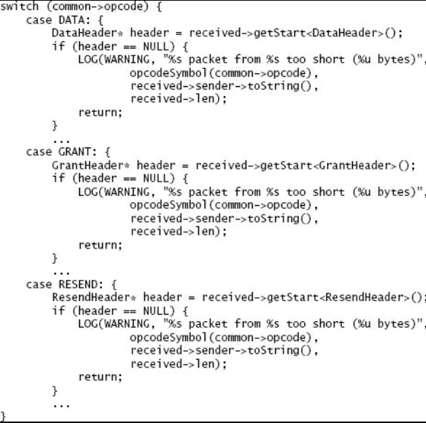
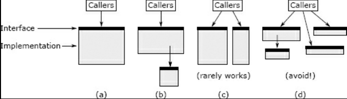

# Chapter 9

## Better Together Or Better Apart?
 > One of the most fundamental questions in software design is this: given two pieces of functionality, should they be implemented together in the same place, or should their implementations be separated?
  - This question applies at all levels in a system, such as functions, methods, classes, and services.

> For example, should buffering be included in the class that provides stream-oriented file I/O, or should it be in a separate class? Should the parsing of an HTTP request be implemented entirely in one method, or should it be divided among multiple methods (or even multiple classes)?
 - This chapter discusses the factors to consider when making these decisions. Some of these factors have already been discussed in previous chapters, but they will be revisited here for completeness.

 > When deciding whether to combine or separate, the goal is to reduce the complexity of the system as a whole and improve its modularity.
 - It might appear that the best way to achieve this goal is to divide the system into a large number of small components: the smaller the components, the simpler each individual component is likely to be.
   - However, the act of subdividing creates additional complexity that was not present before subdivision:

1. Some complexity comes just from the number of components: the more components, the harder to keep track of them all and the harder to find a desired component within the large collection. Subdivision usually results in more interfaces, and every new interface adds complexity.
2. Subdivision can result in additional code to manage the components. For example, a piece of code that used a single object before subdivision might now have to manage multiple objects.
3. Subdivision creates separation: the subdivided components will be farther apart than they were before subdivision.
   - For example, methods that were together in a single class before subdivision may be in different classes after subdivision, and possibly in different files.
   - Separation makes it harder for developers to see the components at the same time, or even to be aware of their existence.
    - If the components are truly independent, then separation is good: 
      - it allows the developer to focus on a single component at a time, without being distracted by the other components.
    - On the other hand, if there are dependencies between the components, then separation is bad:
      - developers will end up flipping back and forth between the components. Even worse, they may not be aware of the dependencies, which can lead to bugs.
4. Subdivision can result in duplication: code that was present in a single instance before subdivision may need to be present in each of the subdivided components.

 > Bringing pieces of code together is most beneficial if they are closely related. If the pieces are unrelated, they are probably better off apart. Here are a few indications that two pieces of code are related:
 1. They share information; for example, both pieces of code might depend on the syntax of a particular type of document.
 2. They are used together: anyone using one of the pieces of code is likely to use the other as well.
    -  This form of relationship is only compelling if it is bidirectional.
    -  As a counter-example, a disk block cache will almost always involve a hash table, but hash tables can be used in many situations that don’t involve block caches; thus, these modules should be separate.
 3. They overlap conceptually, in that there is a simple higher-level category that includes both of the pieces of code.
    - For example, searching for a substring and case conversion both fall under the category of string manipulation; flow control and reliable delivery both fall under the category of network communication.
 4. It is hard to understand one of the pieces of code without looking at the other.

## 9.1 Bring together if information is shared
 > [Section 5.4](https://github.com/kei95/A_philosophy_of_software_design/blob/master/Chapter5.md#54-55-example-http-server) introduced this principle in the context of a project implementing an HTTP server. In its first implementation, the project used two different methods in different classes to read in and parse HTTP requests.\
 - The first method read the text of an incoming request from a network socket and placed it in a string object.
 - The second method parsed the string to extract the various components of the request.

 > With this decomposition, both of the methods ended up with considerable knowledge of the format of HTTP requests:
 - the first method was only trying to read the request, not parse it, but it couldn’t identify the end of the request without doing most of the work of parsing it
 - Because of this shared information, it is better to both read and parse the request in the same place; when the two classes were combined into one, the code got shorter and simpler.

## 9.2 Bring together if it will simplify the interface
 > When two or more modules are combined into a single module, it may be possible to define an interface for the new module that is simpler or easier to use than the original interfaces.
 - This often happens when the original modules each implement part of the solution to a problem.
   - In the HTTP server example from the preceding section, the original methods required an interface to return the HTTP request string from the first method and pass it to the second.
   - When the methods were combined, these interfaces were eliminated.

 > In addition, when the functionality of two or more classes is combined, it may be possible to perform some functions automatically, so that most users need not be aware of them. The Java I/O library illustrates this opportunity.
 - If the FileInputStream and BufferedInputStream classes were combined and buffering were provided by default, the vast majority of users would never even need to be aware of the existence of buffering.
    - A combined FileInputStream class might provide methods to disable or replace the default buffering mechanism, but most users would not need to learn about them.

## 9.3 Bring together to eliminate duplication
 > If you find the same pattern of code repeated over and over, see if you can reorganize the code to eliminate the repetition.
 - One approach is to factor the repeated code out into a separate method and replace the repeated code snippets with calls to the method.
 - This approach is most effective if the repeated code snippet is long and the replacement method has a simple signature.
 - If the snippet is only one or two lines long, there may not be much benefit in replacing it with a method call. If the snippet interacts in complex ways with its environment (such as by accessing numerous local variables), then the replacement method might require a complex signature (such as many pass-by-reference arguments), which would reduce its value.

 > Another way to eliminate duplication is to refactor the code so that the snippet in question only needs to be executed in one place.
 - Suppose you are writing a method that needs to return errors at several different points, and the same cleanup actions need to be performed at each of these points before returning (see **Figure 9.1** for an example).

### Figure 9.1

## 9.4 Separate general-purpose and special-purpose code
 > If a module contains a mechanism that can be used for several different purposes, then it should provide just that one general-purpose mechanism.\
 > It should not include code that specializes the mechanism for a particular use, nor should it contain other general-purpose mechanisms.
 - Special-purpose code associated with a general-purpose mechanism should normally go in a different module (typically one associated with the particular purpose).

## RED FLAG: Repetition
 - If the same piece of code (or code that is almost the same) appears over and over again, that’s a red flag that you haven’t found the right abstractions.

 > **In general, the lower layers of a system tend to be more general-purpose and the upper layers more special-purpose.**
 - the topmost layer of an application consists of features totally specific to that application.
 - The way to separate special-purpose code from general-purpose code is to pull the special-purpose code upwards, into the higher layers, leaving the lower layers general-purpose.
   - When you encounter a class that includes both general-purpose and special-purpose features for the same abstraction, ***see if the class can be separated into two classes, one containing the general-purpose features, and the other layered on top of it to provide the special-purpose features.***

## RED FLAG: Special-General Mixture
 - This red flag occurs when a general-purpose mechanism also contains code specialized for a particular use of that mechanism.
 - This makes the mechanism more complicated and creates information leakage between the mechanism and the particular use case: future modifications to the use case are likely to require changes to the underlying mechanism as well.

## 9.8 Splitting and joining methods
 > You shouldn't break up a method unless it makes the overall system simpler
 - if each block is in a separate method, readers will have to flip back and forth between these spread-out methods in order to understand how they work together
    - Methods containing hundreds of lines are fine if they have a simple signature and are easy to read. These methods are deep
 ### **Figure9.3**

 > When designing methods, the most important goal is to provide clean and simple abstractions.
  - ***Each method should do one thing and do it completely***
- Those methods in **a** and **b** are the good way of writing / refactoring method
  - **b** is a subdivision of the code that results in child method containing the subtask and a parent method containing the remainder of the original method
   - However, if you make a split of this form and ended up finding yourself flipping back and forth between the parent and child to understand how they work together, that is a red flat("Conjoined Methods")
 - **c** is to split it into two separate methods. This makes sense if the original method had an overly complex interface because it tried to do multiple things that were not closely related.
    - After this separation, each of interface of methods should be simpler than the original one.
    - if callers must invoke both of separated method, it's a indication of the bad idea.

 > There are also situations where a system can be made simpler by joining methods together.

## RED FLAG: Conjoined Methods
 - It should be possible to understand each method independently. If you can't understand the implementation of one method without also understanding the other, that's a red flag. This red flag can occur in other contexts as well:
   - If tow pieces of code are physically separated, but each can only be understood by looking at the other, that also is a red flag.

## 9.9 Conclusion
 - The decision to split or join modules should be based on complexity. Pick the structure that results in the best information hiding, the fewest dependencies, and the deepest interfaces